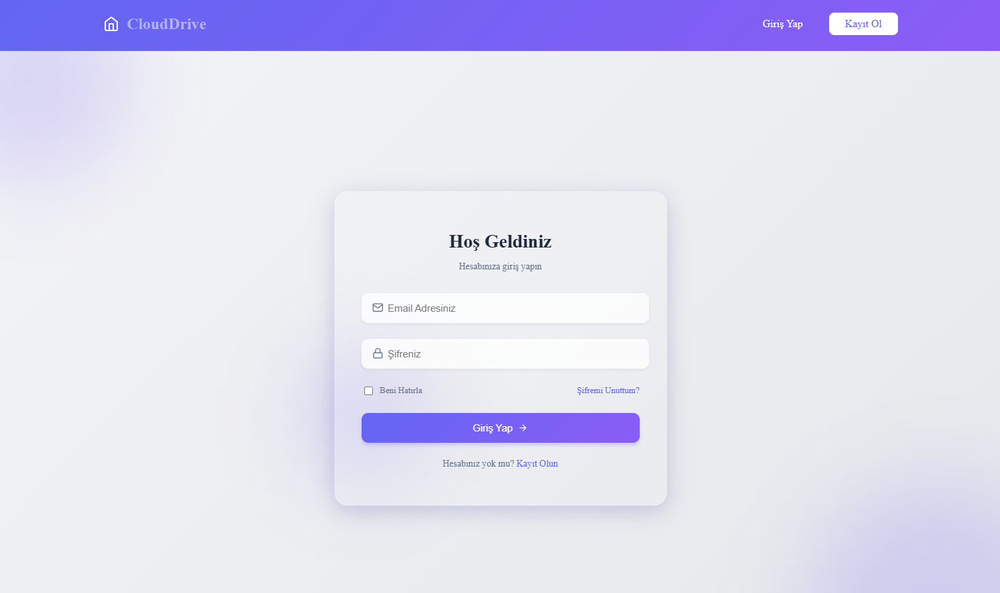
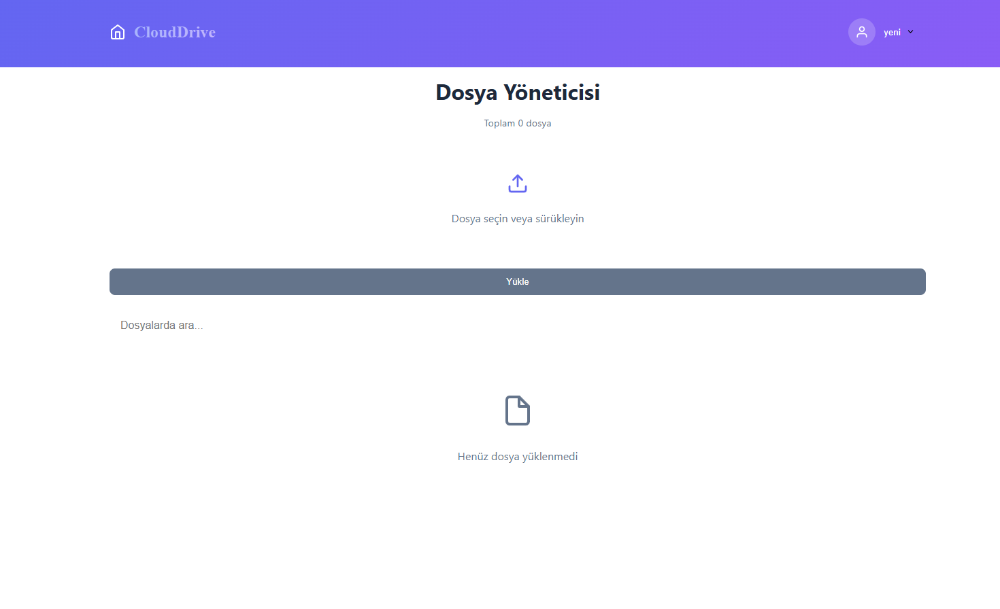
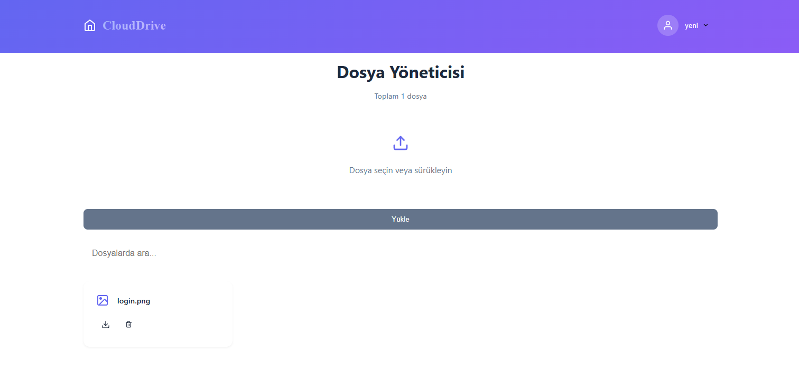

# 📁 Dosya Yönetim Uygulaması

Kullanıcıların PDF, PNG veya JPG gibi dosyaları yükleyip listeleyebildiği ve silebildiği, JWT ile güvenli giriş sistemi bulunan basit bir web uygulaması.

## 🚀 Özellikler

- ✅ Kullanıcı kayıt ve giriş (JWT ile)
- 📤 Dosya yükleme (.pdf, .png, .jpg)
- 📋 Dosya listeleme
- ❌ Dosya silme
- 🔐 Yetkilendirme korumalı dashboard
- 📂 Sunucuya dosya kaydı (uploads klasörü)

## 🛠️ Teknolojiler

- **Frontend:** HTML, CSS, JavaScript
- **Backend:** Node.js, Express.js
- **Veritabanı:** MongoDB
- **Kimlik Doğrulama:** JSON Web Token (JWT)
- **Dosya Yükleme:** Multer

## 🧪 API Uç Noktaları

| Yöntem | Uç Nokta         | Açıklama                  |
|--------|------------------|---------------------------|
| POST   | /register        | Kullanıcı kayıt olur      |
| POST   | /login           | Giriş yapar, token alır   |
| GET    | /dashboard       | Tüm dosyaları listeler    |


## 🖥️ Ekran Görüntüleri

### 🔐 Giriş Ekranı



### 📤 Dosya Yükleme Ekranı



### 📋 Dosya Listeleme




## 📦 Kurulum

```bash
# Projeyi klonla
git clone https://github.com/kullanici/dosya-yonetim.git


# Backend’i başlat
cd backend
npm start

# Frontend’i başlat
cd frontend
npm run dev

# Projeyi başlat (Backend ve Frontend eş zamanlı çalışmaya başlar)
npm run project

